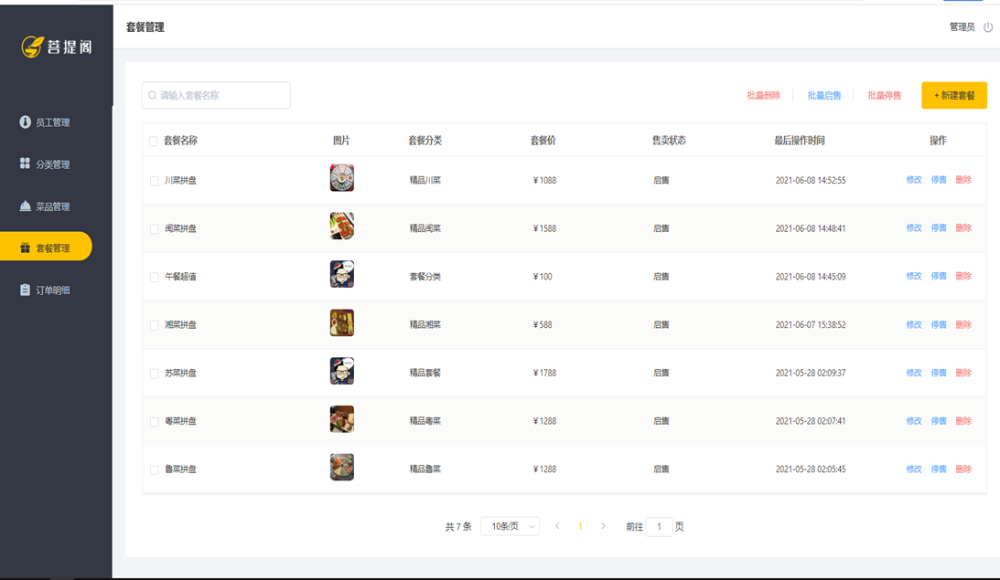
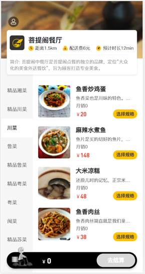

# 🍔🍟📱💻   Easy Catering

### 1. Project introduction
Easy Catering is a software product specially customized for catering enterprises (restaurants, hotels), including two parts: the system management background and the mobile terminal application. The system management background is mainly provided for internal employees of catering companies, and can manage and maintain restaurant categories, dishes, set meals, orders, employees, etc. Mobile applications are mainly provided to consumers, who can browse dishes online, add shopping carts, place orders, etc.

- Background management: http://localhost:8080/backend/index.html
- Front-end page: http://localhost:8080/front/index.html

## 1. 🧑‍💼 management terminal

The management terminal is mainly for the internal staff of the restaurant, providing the following functions:

### Login/Logout

Internal employees must log in to access the system management background.

### Employee Management

Administrators can manage employee information in the background of the system, including query, add, edit, disable and other functions.

### Category management

Classification management mainly manages and maintains the classification of dishes or set meals operated by the current restaurant, including functions such as query, addition, modification, and deletion.

### Dishes Management

Dishes management mainly maintains the information of dishes under each category, including functions such as query, addition, modification, deletion, start of sale, and stop of sale.

### Package Management

The package management mainly maintains the package information in the current restaurant, including query, add, modify, delete, start selling, stop selling and other functions.

### Order Details

The order details mainly maintain the order information placed by the user on the mobile terminal, including functions such as inquiry, cancellation, delivery, completion, and order report download.

## 2. 🧑‍🤝‍🧑 client

The client side is mainly for consumers and provides the following functions:

### Login/Logout

On the mobile side, users also need to log in and use the app to order food.

### Order-Menu

In the ordering interface, it is necessary to display the category of dishes/sets, and load the information of the dishes in it according to the currently selected category for users to query and select.

### Order - shopping cart

The dishes selected by the user will be added to the user's shopping cart, which mainly includes functions such as querying the shopping cart, adding to the shopping cart, deleting the shopping cart, and emptying the shopping cart.

### Order Payment

After the user selects the dishes/sets, he can settle and pay for the dishes in the shopping cart, and at this time, he needs to pay for the order.

### personal information

The basic information of the current user will be displayed on the personal center page, and the user can manage the delivery address and query historical order data.

## 2. Technology selection

Regarding the technology selection of this project, we will introduce it from the aspects of user layer, gateway layer, application layer, and data layer. For our server development engineers, during the project development process, we mainly focus on the application Application of layer and data layer technologies.

### 1. User layer

When building the front-end page of the system management background, we will use technologies such as H5, Vue.js, and ElementUI. When building mobile applications, we will use WeChat applets.

### 2. Gateway layer

Nginx is a server that is mainly used as an Http server to deploy static resources with high access performance. There are two more important functions in Nginx: reverse proxy and load balancing. During project deployment, to achieve Tomcat load balancing, it can be achieved through Nginx.

### 3. Application layer

- SpringBoot: Quickly build Spring projects, adopting the idea of "convention is better than configuration" to simplify the configuration and development of Spring projects.
- Spring: Unified management of various resources (beans) in the project will be used in all layers of Web development.
- SpringMVC: SpringMVC is a module of the Spring framework. SpringMVC and Spring do not need to be integrated through an intermediate integration layer, and can be seamlessly integrated.
- SpringSession: mainly solves the problem of Session sharing in a cluster environment.
- Lombok: It can simplify Java code in the form of simple annotations and improve the development efficiency of developers. For example, JavaBean that often needs to be written in development requires time to add corresponding getters/setters, and perhaps write methods such as constructors and equals.
- Swagger: It can automatically help developers generate interface documents and test the interfaces.

### 4. Data layer

- MySQL: relational database, the core business data of this project will be stored in MySQL.
- MybatisPlus: The persistence layer of this project will use MybatisPlus to simplify development, and the basic single table addition, deletion, modification and query can directly call the methods provided by the framework.
- Redis: An in-memory database based on key-value format storage, with fast access speed, it is often used as a cache (reduces database access pressure and improves access efficiency), and will be used in later performance optimization.

### 5. Tools

- Git: version control tool, in team collaboration, use this tool to manage the code in the project.
- Maven: Project build tool.
- JUnit: A unit testing tool. After the developer's functions are implemented, they need to unit test the functions through JUnit.

## 3. Functional Architecture

### 1. The front desk function of the mobile terminal

Mobile phone number login, WeChat login, recipient address management, user history order query, dish specification query, shopping cart function, ordering, category and dish browsing.

### 2. System management background function

Employee login/exit, employee information management, category management, dish management, package management, dish taste management, order management.

## 4. User roles

In the Easy Catering project, there are the following three types of users, which correspond to three roles: background system administrators, background system employees, and C-end (mobile) users.

| Role | Permission Operation |
| ---------------- | -------------------------------- ---------------------------- |
| Background system administrator | Log in to the background management system and have all operation rights in the background system |
| Ordinary employees of the background system | Log in to the background management system to manage dishes, packages, orders, etc. (not including employee management) |
| C-end users | Log in to the mobile app, you can browse dishes, add shopping carts, set addresses, place orders online, etc. |