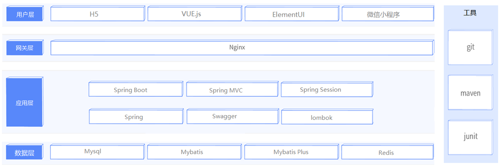

# 🍔🍟📱💻 瑞吉外卖

瑞吉外卖是一款专门为餐饮企业（餐厅、饭店）定制的软件产品，包括系统管理后台和移动端应用两部分。系统管理后台主要提供给餐饮企业内部员工使用，可以对餐厅的分类、菜品、套餐、订单、员工等进行管理维护。移动端应用主要提供给消费者使用，可以在线浏览菜品、添加购物车、下单等。

## 🧑‍💼 管理端

管理端主要面向餐厅内部员工，提供以下功能：

### 登录/退出

内部员工必须登录后才能访问系统管理后台。

### 员工管理

管理员可以在系统后台对员工信息进行管理，包括查询、新增、编辑、禁用等功能。

### 分类管理

分类管理主要对当前餐厅经营的菜品分类或套餐分类进行管理维护，包括查询、新增、修改、删除等功能。

### 菜品管理

菜品管理主要维护各个分类下的菜品信息，包括查询、新增、修改、删除、启售、停售等功能。

### 套餐管理

套餐管理主要维护当前餐厅中的套餐信息，包括查询、新增、修改、删除、启售、停售等功能。

### 订单明细

订单明细主要维护用户在移动端下的订单信息，包括查询、取消、派送、完成，以及订单报表下载等功能。

## 🧑‍🤝‍🧑 用户端

用户端主要面向消费者，提供以下功能：

### 登录/退出

在移动端，用户也需要登录后使用APP进行点餐。

### 点餐-菜单

在点餐界面需要展示出菜品分类/套餐分类，并根据当前选择的分类加载其中的菜品信息，供用户查询选择。

### 点餐-购物车

用户选中的菜品就会加入用户的购物车，主要包含查询购物车、加入购物车、删除购物车、清空购物车等功能。

### 订单支付

用户选完菜品/套餐后，可以对购物车菜品进行结算支付，这时就需要进行订单的支付。

### 个人信息

在个人中心页面中会展示当前用户的基本信息，用户可以管理收货地址，也可以查询历史订单数据。

### 技术选型

## 用户层

在构建系统管理后台的前端页面，我们会使用到 H5、Vue.js、ElementUI 等技术。而在构建移动端应用时，我们会使用到微信小程序。

## 网关层

Nginx 是一个服务器，主要用来作为 Http 服务器，部署静态资源，访问性能高。在 Nginx 中还有两个比较重要的作用：反向代理和负载均衡。在进行项目部署时，要实现 Tomcat 的负载均衡，就可以通过 Nginx 来实现。

## 应用层

- SpringBoot：快速构建 Spring 项目，采用 "约定优于配置" 的思想，简化 Spring 项目的配置开发。
- Spring：统一管理项目中的各种资源 (bean)，在 Web 开发的各层中都会用到。
- SpringMVC：SpringMVC 是 Spring 框架的一个模块，SpringMVC 和 Spring 无需通过中间整合层进行整合，可以无缝集成。
- SpringSession：主要解决在集群环境下的 Session 共享问题。
- Lombok：能以简单的注解形式来简化 Java 代码，提高开发人员的开发效率。例如开发中经常需要写的 JavaBean，都需要花时间去添加相应的 getter/setter，也许还要去写构造器、equals 等方法。
- Swagger：可以自动的帮助开发人员生成接口文档，并对接口进行测试。

## 数据层

- MySQL：关系型数据库，本项目的核心业务数据都会采用 MySQL 进行存储。
- MybatisPlus：本项目持久层将会使用 MybatisPlus 来简化开发，基本的单表增删改查直接调用框架提供的方法即可。
- Redis：基于 key-value 格式存储的内存数据库，访问速度快，经常使用它做缓存 (降低数据库访问压力，提供访问效率)，在后面的性能优化中会使用。

## 工具

- Git：版本控制工具，在团队协作中，使用该工具对项目中的代码进行管理。
- Maven：项目构建工具。
- JUnit：单元测试工具，开发人员功能实现完毕后，需要通过 JUnit 对功能进行单元测试。